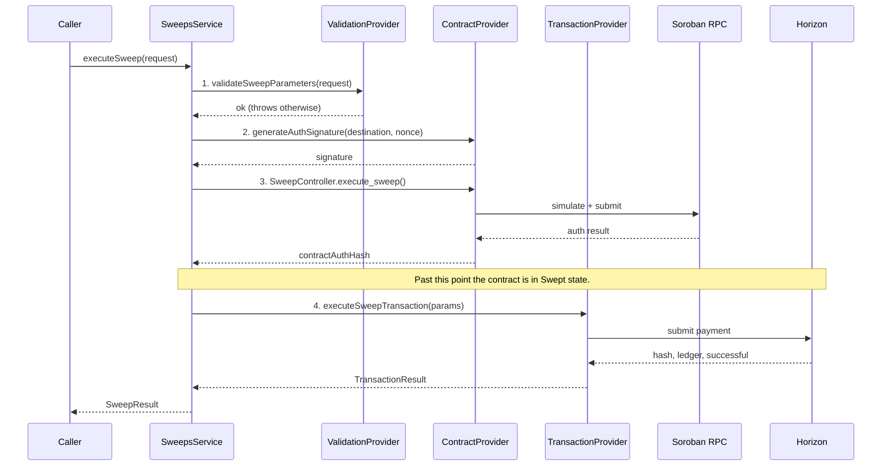

# Sweeps Module

Moves funds out of an ephemeral account into a destination account, gated by an
on-chain authorization from the `SweepController` Soroban contract.

## Sweep Flow

This is the authoritative description of the flow. It previously existed only as
a comment on `SweepsService.executeSweep`, so it had to be reverse-engineered
from code (#651).

> Verified for #712 (duplicate of the already-resolved #651, fixed in PR #778).

The order of operations is strict and intentional:

1. **Validate** - `ValidationProvider.validateSweepParameters()` checks the
   request before anything touches the network.
2. **Authorize (sign)** - `ContractProvider.generateAuthSignature()` signs the
   destination and the contract nonce with the sweep signing key.
3. **Authorize (submit)** - `SweepController.execute_sweep()` is invoked on
   Soroban, moving the contract into `Swept` state.
4. **Transfer** - `TransactionProvider.executeSweepTransaction()` submits a
   classic payment to Horizon, actually moving the funds.



### Failure between steps 3 and 4

If step 3 succeeds and step 4 fails, the contract is in `Swept` state but **no
funds have moved**. This is logged as a critical error for manual recovery and
is deliberately **not** retried automatically - re-invoking `execute_sweep()`
would revert on-chain.

The retry path is driven by the orchestrator (`ClaimRedemptionProvider`), which
re-enters with `skipContractAuth: true`. `SweepsService` then synthesises the
auth hash deterministically from the same inputs, so the audit trail is
preserved without touching the contract again.

### Reclaiming the base reserve

The flow above is payment-only, so the ephemeral account's base reserve stays
locked up. `TransactionProvider.mergeAccount()` implements the alternative
`AccountMerge` strategy that also reclaims the reserve, but `SweepsService`
never calls it - treat it as available but not wired into the live flow.

## Usage

### Execute a Sweep

```typescript
const result = await sweepsService.executeSweep({
  accountId: '550e8400-e29b-41d4-a716-446655440000',
  ephemeralPublicKey:
    'GEPH47IF6LWK7P7MDEVSCWR7DPUWV3NY3DTQEVFL4NAT4AQH3ZLLFLA5',
  ephemeralSecret: 'SEPH47IF6LWK7P7MDEVSCWR7DPUWV3NY3DTQEVFL4NAT4AQH3ZLLFLA5',
  destinationAddress:
    'GBULQKZ7SA56UKRI6LX2IB6XH3GJW2L34BMTOWMQFJBAQNPSHJJNOTGN',
  amount: '100.0000000',
  asset: 'native',
});

// Result:
// {
//   success: true,
//   txHash: 'abc123...',
//   contractAuthHash: 'def456...',
//   amountSwept: '100.0000000',
//   destination: 'GDEST...',
//   timestamp: Date
// }
```

### Check if Account Can Be Swept

```typescript
const canSweep = await sweepsService.canSweep(accountId, destinationAddress);

if (canSweep) {
  // Proceed with sweep
}
```

### Get Detailed Sweep Status

```typescript
const status = await sweepsService.getSweepStatus(accountId);

// Possible responses:
// { canSweep: true }
// { canSweep: false, reason: 'Account not found' }
// { canSweep: false, reason: 'Already swept' }
// { canSweep: false, reason: 'Account expired' }
// { canSweep: false, reason: 'Payment not received' }
```

## Testing

### Run All Tests

```bash
npm run test -- sweeps
```

### Run Specific Provider Tests

```bash
npm run test -- validation.provider.spec
npm run test -- contract.provider.spec
npm run test -- transaction.provider.spec
npm run test -- sweeps.service.spec
```

### Coverage

```bash
npm run test:cov -- sweeps
```

**Coverage Goals:**

- Statements: >90%
- Branches: >85%
- Functions: >90%
- Lines: >90%

### Manual End-to-End Testing

1. Create funded ephemeral account on testnet
2. Execute sweep with valid parameters:

```bash
curl -X POST http://localhost:3000/api/sweeps \
  -H "Content-Type: application/json" \
  -d '{
    "accountId": "...",
    "ephemeralPublicKey": "...",
    "ephemeralSecret": "...",
    "destinationAddress": "...",
    "amount": "100",
    "asset": "native"
    }'
```

3. Verify transaction on Stellar Explorer
4. Check destination account received funds
5. Verify ephemeral account merged (if successful)

## Configuration

### Required Environment Variables

```env
# Stellar Network
STELLAR_NETWORK=testnet
STELLAR_HORIZON_URL=https://horizon-testnet.stellar.org
STELLAR_SOROBAN_RPC_URL=https://soroban-testnet.stellar.org

# Smart Contract
EPHEMERAL_ACCOUNT_CONTRACT_ID=CXXXXXXXXXXXXXXXXXXXXXXXXXXXXXXXXXXXXXXXXXXXXXXXXXXXXXX
```

### Network Selection

- **Testnet:** Use for development and testing
- **Mainnet:** Production only (real money!)

Network determines:

- Horizon URL
- Soroban RPC URL
- Network passphrase
- Contract deployment

## Deployment

### Prerequisites

1. Deploy ephemeral account contract to target network
2. Note contract ID
3. Configure environment variables
4. Fund accounts for testing

### Security Considerations

1. **Secret Key Handling:**
   - Ephemeral secrets are temporary
   - Never log secret keys
   - Clear from memory after use

2. **Authorization Signatures:**
   - MVP uses dummy signatures
   - Production must implement proper Ed25519 signing
   - Use authorized SDK keys

3. **Transaction Verification:**
   - Always verify transaction success
   - Check ledger confirmation
   - Monitor for failed transactions

4. **Rate Limiting:**
   - Implement rate limits on sweep endpoints
   - Prevent DOS attacks
   - Monitor for suspicious patterns

## Future Improvements

### Short Term

1. **Production Signature Implementation:**
   - Replace dummy signatures with real Ed25519
   - Sign with authorized SDK private key
   - Verify signatures in contract

2. **On-Chain Authorization Enforcement:**
   - Submit contract transactions
   - Enforce authorization on-chain
   - Store sweep records in contract

3. **Enhanced Validation:**
   - Check destination account exists
   - Verify destination can receive asset
   - Validate minimum amounts

### Long Term

1. **Batch Sweeps:**
   - Sweep multiple accounts in one transaction
   - Reduce transaction fees
   - Improve efficiency

2. **Gas Optimization:**
   - Optimize contract calls
   - Reduce transaction sizes
   - Minimize operations

3. **Monitoring & Alerts:**
   - Real-time sweep monitoring
   - Alert on failures
   - Track success rates

4. **Retry Mechanisms:**
   - Automatic retry for failed transactions
   - Exponential backoff
   - Dead letter queue for persistent failures

## Troubleshooting

### Common Issues

**Transaction Fails with "op_underfunded":**

- Ephemeral account has insufficient XLM for fee
- Need minimum 0.5 XLM for transaction fees

**Account Merge Fails:**

- Check for active offers: `account.offers().call()`
- Check for trustlines: `account.balances`
- Remove before merging

**Contract Simulation Fails:**

- Verify contract ID is correct
- Check Soroban RPC URL
- Ensure contract is deployed on network

**Address Validation Fails:**

- Stellar addresses are 56 characters
- Must start with 'G'
- Use `StrKey.isValidEd25519PublicKey()`

### Debug Logging

Enable debug logs:

```typescript
Logger.overrideLogger(['log', 'debug', 'error', 'warn']);
```

Check logs for:

- Validation failures
- Contract simulation errors
- Transaction extras (Horizon errors)
- Account merge warnings

## Support

For issues or questions:

1. Check this README
2. Review test files for examples
3. Check Stellar documentation
4. Open GitHub issue
